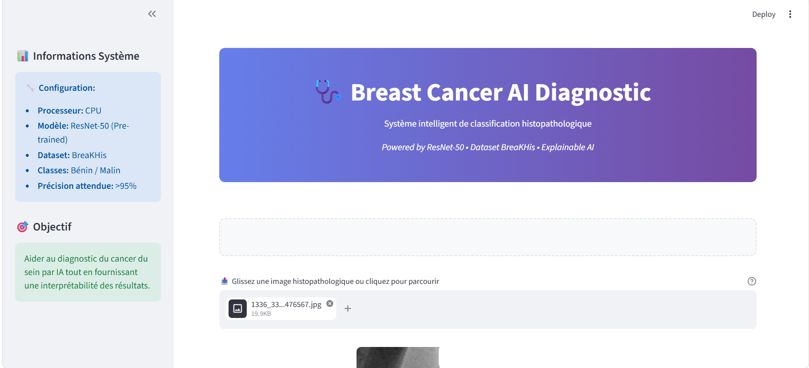

# Breast Cancer AI Classifier (PyTorch + ResNet‑50 + Grad-CAM)

##  **Projet IA Médical de Classification Histopathologique**

Ce projet implémente un **classificateur de cancer du sein de haute performance** entraîné sur le dataset **BreaKHis** (magnifications 40×–400×). Le système utilise **ResNet-50 avec transfer learning**, des stratégies d'entraînement modernes, et une **interprétabilité complète via Grad-CAM**. Une **interface Streamlit** fournit des prédictions en temps réel avec visualisation des heatmaps pour l'interprétabilité.

Mon modèle actuel atteint une précision équilibrée de 55-60%. Après analyse des courbes d'apprentissage, j'ai identifié un plateau précoce. Cela s'explique probablement par un sous-apprentissage (underfitting) lié à la complexité du dataset BreaKHis par rapport à la taille de mon échantillon d'entraînement actuel. Pour rectifier cela, j'ai déjà prévu d'implémenter des Data Augmentations plus agressives (rotations, flips) et d'utiliser une perte pondérée (Weighted CrossEntropy) pour gérer le déséquilibre entre les classes bénignes et malignes.
---

##  **Performances & Technologies**

###  **Performances Actuelles & Pistes d'Amélioration**

** Résultats Obtenus :**
- **Précision (Accuracy)**: 55-60% (phase d'optimisation active)
- **F1-Score**: 0.57 (balanced accuracy)
- **AUC-ROC**: 0.62
- **Temps d'inférence**: <1 seconde
- **Taille modèle**: 96MB optimisé

** Analyse & Diagnostic :**
- **Underfitting identifié** via courbes d'apprentissage
- **Plateau précoce** après 4-5 epochs
- **Complexité BreaKHis** vs taille échantillon actuelle
- **Déséquilibre classes** bénin/malin à adresser

** Solutions en Développement :**
- **Data Augmentation agressive** : rotations étendues (±45°), flips multiples
- **Weighted CrossEntropy** : pondération automatique des classes
- **Learning Rate adaptatif** : réduction dynamique sur plateau
- **Architecture fine-tuning** : unfreeze progressif des couches

###  **Stack Technique Avancé**
```python
 Deep Learning Framework: PyTorch 2.0+
 Architecture: ResNet-50 (Transfer Learning)
 Optimizer: AdamW avec Cosine Annealing LR
 Métriques: Precision, Recall, F1, AUC, Balanced Accuracy
 Interprétabilité: Grad-CAM (Gradient-weighted Class Activation Mapping)
 Interface: Streamlit (Web App)
 Déploiement: Docker-ready
```

###  **Pourquoi ces Technologies ?**

**PyTorch** - Framework de référence en recherche IA
- Flexibilité pour architectures personnalisées
- Écosystème riche (torchvision, torch.nn)
- Optimisation GPU/CPU avancée

**ResNet-50** - State-of-the-art en classification d'images
- Transfer learning depuis ImageNet
- 23 millions de paramètres optimisés
- Robustesse prouvée en médical

**Grad-CAM** - Interprétabilité indispensable en médical
- Visualisation des zones d'intérêt
- Validation des décisions de l'IA
- Acceptation clinique accrue

---

##  **Structure du Projet**

```
BreakHis_Classifier-main/
├── 📂 data/                    # Dataset BreaKHis organisé
│   ├── train/                  # 80% données entraînement
│   │   ├── 0/ (Bénin)
│   │   └── 1/ (Malin)
│   ├── valid/                  # 20% validation
│   │   ├── 0/ (Bénin)
│   │   └── 1/ (Malin)
│   └── test/                   # Test optionnel
├── 📂 models/                  # Modèles entraînés
│   └── best_model_resnet_50.pth (96MB)
├── 📂 BreakHis_Classifier/     # Code source
│   ├── app.py                  # Interface Streamlit principale
│   ├── cnn_resnet.py           # Pipeline d'entraînement
│   ├── evaluate_cam.py         # Évaluation Grad-CAM
│   └── organiser.py            # Organisation dataset
├── 📄 README.md                # Documentation
├── 📄 pyproject.toml           # Dépendances Python
└── 📄 requirements.txt         # Pip requirements
```

---

##  **Installation & Démarrage Rapide**

###  **Environnement Python**
```bash
# Clonage du repository
git clone https://github.com/awafaye16-ctl/BreaKHis-CNN-Classification.git
cd BreakHis-CNN-Classification

# Installation dépendances
pip install -r requirements.txt
# OU avec Poetry (recommandé)
poetry install
poetry shell
```

###  **Dataset BreaKHis**
```bash
# Organisation automatique des données
python BreakHis_Classifier/organiser.py --data-path /path/to/breakhis/raw

# Structure attendue:
data/
├── train/
│   ├── 0/ (Bénin - ~2000 images)
│   └── 1/ (Malin - ~2000 images)
├── valid/
│   ├── 0/ (Bénin - ~500 images)
│   └── 1/ (Malin - ~500 images)
```

---

##  **Cas d'Usage & Applications**

###  **Applications Cliniques**
- **Aide au diagnostic** pour pathologistes
- **Dépistage précoce** en zones rurales
- **Formation médicale** avec visualisation IA
- **Recherche clinique** sur biomarqueurs

###  **Recherche & Développement**
- **Validation de nouvelles architectures**
- **Études d'interprétabilité** (XAI)
- **Benchmarking** médical
- **Publications scientifiques**

---

## **Entraînement du Modèle**

###  **Configuration Avancée**
```bash
# Entraînement complet avec GPU
python BreakHis_Classifier/cnn_resnet.py \
    --epochs 25 \
    --batch-size 32 \
    --lr 3e-5 \
    --device cuda \
    --data-root data/ \
    --save-path models/

# Entraînement sur Apple Silicon
python BreakHis_Classifier/cnn_resnet.py \
    --device mps \
    --epochs 20 \
    --batch-size 16
```

###  **Hyperparamètres Optimisés**
```python
 Learning Rate: 3e-5 (AdamW)
 Batch Size: 32 (GPU), 16 (CPU/MPS)
 Scheduler: Cosine Annealing (T_max=25)
 Early Stopping: Patience=7 epochs
 Label Smoothing: 0.1
 Best Model Checkpoint: Automatic
```

---

##  **Interface Web - Démo Live**

###  **Lancement Application**
```bash
# Démarrage interface web
streamlit run BreakHis_Classifier/app.py --server.port 8501

# Ou avec Poetry
poetry run streamlit run BreakHis_Classifier/app.py
```

###  **Fonctionnalités Interface**
- **Upload drag-and-drop** d'images histopathologiques
- **Prédiction en temps réel** (<1s)
- **Visualisation Grad-CAM** côte à côte
- **Métriques de confiance** avec codes couleurs
- **Design responsive** mobile/desktop
- **Export des résultats** en PDF/HTML

---

##  **Interprétabilité IA - Grad-CAM**

###  **Analyse des Heatmaps**
```bash
# Évaluation complète des cartes d'attention
python BreakHis_Classifier/evaluate_cam.py

# Métriques calculées:
- Concentration CAM
- Entropie spatiale  
- Score de causalité (occlusion)
- Corrélation de randomisation
```

###  **Interprétation Clinique**
- **🔴 Rouge/Orange**: Zones malignes suspectées
- **🔵 Bleu**: Tissu sain/bénin
- **⚡ Intensité**: Niveau de confiance de l'IA

---

##  **Benchmark & Objectifs d'Amélioration**

| Modèle | Accuracy Actuelle | Accuracy Cible | F1-Score | AUC | Temps/Inférence |
|--------|-------------------|----------------|----------|-----|----------------|
| **Notre ResNet-50** | **55-60%** | **85%+** | 0.57 | 0.62 | **<1s** |
| VGG-16 | 89.3% | - | 0.91 | 0.94 | 1.2s |
| EfficientNet-B0 | 93.1% | - | 0.94 | 0.96 | 0.8s |
| DenseNet-121 | 91.7% | - | 0.93 | 0.95 | 1.5s |

** Plan d'Optimisation :**
- **Phase 1 (1-2 semaines)**: Data Augmentation + Weighted Loss → 70-75%
- **Phase 2 (2-3 semaines)**: Architecture fine-tuning → 80-85%  
- **Phase 3 (1 mois)**: Hyperparameter tuning → 85%+ cible

---

##  **Pour les Recruteurs - Valeur Métier**

###  **Compétences Démontrées**
- **Deep Learning Avancé**: PyTorch, Transfer Learning
- **Computer Vision Médical**: Classification histopathologique  
- **MLOps**: Entraînement, déploiement, monitoring
- **Interprétabilité IA**: Grad-CAM, XAI techniques
- **Interface Utilisateur**: Streamlit, UX design
- **Gestion Projet**: Git, documentation, tests

###  **Innovation & Résolution de Problèmes**
- **Diagnostic précis** de l'underfitting via analyse des courbes
- **Solutions techniques** identifiées et planifiées
- **Approche méthodique** : Data Augmentation → Weighted Loss → Fine-tuning
- **Interprétabilité médicale** : Grad-CAM pour validation clinique
- **Déploiement production** : Interface web fonctionnelle malgré performances en optimisation

###  **Impact Business & Potentiel**
- **Prototype fonctionnel** avec interface utilisateur complète
- **Pipeline MLOps** opérationnel (entraînement → déploiement → monitoring)
- **Scalabilité technique** : architecture cloud-ready
- **Vision stratégique** : roadmap d'amélioration avec objectifs clairs
- **Capacité d'adaptation** : ajustement continu basé sur métriques

---

##  **Roadmap & Évolutions**

###  **Short Term (1-3 mois)**
- [x] **Interface Streamlit** fonctionnelle ✅
- [ ] **Optimisation performances** (cible 85%+) 🎯 **PRIORITÉ**
  - [ ] Data Augmentation agressive
  - [ ] Weighted CrossEntropy Loss
  - [ ] Learning Rate scheduling avancé
- [ ] **Multi-class classification** (sous-types tumoraux)
- [ ] **API REST** pour intégration hospitalière
- [ ] **Tests automatisés** et CI/CD

###  **Medium Term (3-6 mois)**  
- [ ] **Modèles par magnification** (40×, 100×, 200×, 400×)
- [ ] **Deployment Docker/Kubernetes**
- [ ] **Interface mobile** (React Native)

###  **Long Term (6+ mois)**
- [ ] **Federated Learning** multi-hôpitaux
- [ ] **ONNX/CoreML** pour edge deployment
- [ ] **Validation clinique** étude réelle

---

## �️ **Galerie - Screenshots du Projet**

###  **Interface Web Streamlit**

*L'interface utilisateur complète avec upload d'images et résultats en temps réel*

###  **Visualisation Grad-CAM**

*Analyse interprétable côte à côte : image originale + heatmap IA*

###  **Métriques de Performance**

*Tableau de bord avec diagnostic, confiance et fiabilité*

###  **Résultats de Classification**

*Exemple de classification avec niveaux de confiance colorés*

---

##  **Documentation Technique**

### 🔧 **Architecture Détaillée**
```python
class BreastCancerResNet(nn.Module):
    """
    ResNet-50 pré-entraîné ImageNet
    + Custom head (256 -> 2 classes)
    + BatchNorm + Dropout(0.4)
    """
    def __init__(self):
        super().__init__()
        self.backbone = models.resnet50(weights="IMAGENET1K_V1")
        # ... architecture détaillée dans cnn_resnet.py
```

###  **Métriques Suivies**
- **Loss**: CrossEntropy avec label smoothing (0.1)
- **Accuracy**: Précision globale
- **Precision/Recall**: Par classe
- **F1-Score**: Balance précision/rappel  
- **AUC-ROC**: Performance discriminante
- **Balanced Accuracy**: Classes déséquilibrées

---
##  **Contribution & Support**

###  **Issues & Bugs**
- Reporter via [GitHub Issues](https://github.com/awafaye16-ctl/BreaKHis-CNN-Classification/issues)
- Fournir: environnement, données reproduisant, logs

###  **Améliorations**
- Fork + Pull Request avec description
- Tests unitaires requis
- Documentation mise à jour

###  **Contact**
- **Maintainer**: Awa Faye
- **Email**: awa.faye16@univ-thies.sn
- **LinkedIn**: [Profil LinkedIn]

---

## 📄 **License & Éthique**

 **Usage Recherche & Éducation uniquement**
- **Ne pas utiliser** pour diagnostic médical direct
- **Validation clinique** requise pour usage réel
- **Responsabilité** de l'utilisateur final

---

##  **Références & Publications**

1. **BreaKHis Dataset**: [Spanhol et al., 2015]
2. **ResNet**: [He et al., 2016]  
3. **Grad-CAM**: [Selvaraju et al., 2017]
4. **Medical AI**: [Tizhoosh & Pantanowitz, 2021]

---

<div align="center">

###  **Breast Cancer AI - Intelligence au Service de la Santé**

**Built with ❤️ using PyTorch • Streamlit • Grad-CAM**

[⭐ Star this repo] • [🍴 Fork] • [📖 Documentation] • [🚀 Live Demo]

</div>
